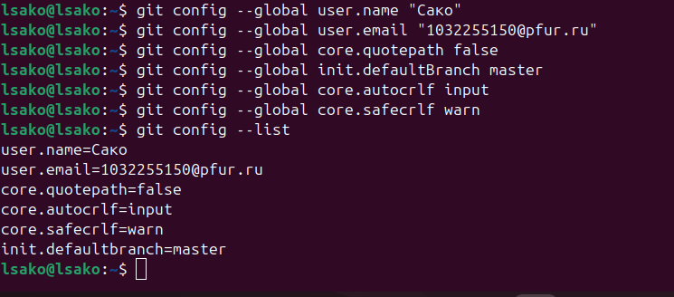
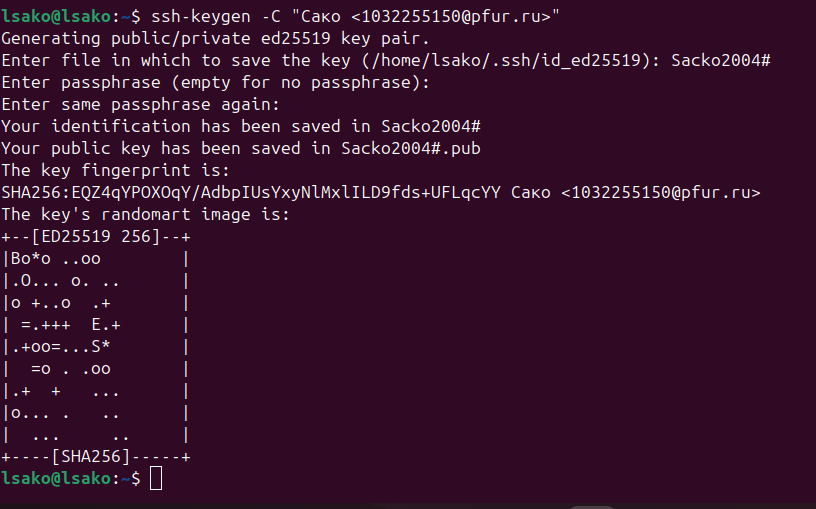
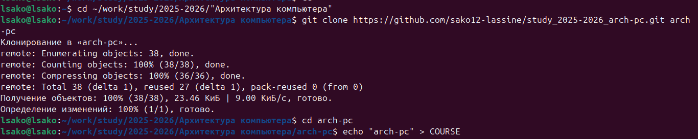
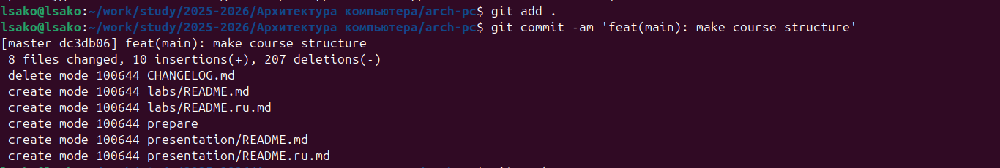
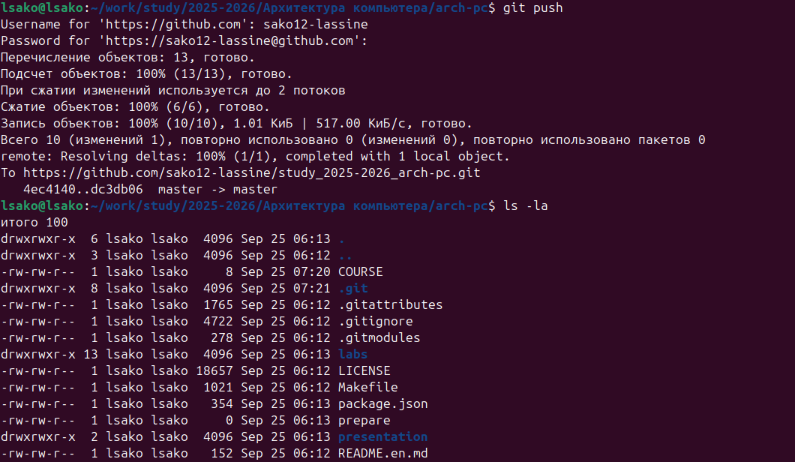

# Цель работы
Изучение идеологии и применения средств контроля версий, приобретение практических навыков по работе с системой контроля версий git.

# Ход работы

## 1. Настройка GitHub
- Создана учетная запись на GitHub
- Заполнены основные данные профиля

## 2. Базовая настройка Git

git config --global user.name "Сако Лассине"
git config --global user.email "1032255150@pfur.ru"
git config --global core.quotepath false
git config --global init.defaultBranch master

*Рис. 2.1: Базовая конфигурация Git*

## 3. Создание SSH-ключа

ssh-keygen -C "Сако Лассине <1032255150@pfur.ru>"

*Рис. 3.1: Процесс создания SSH-ключа*

## 4. Создание рабочего пространства

mkdir -p ~/work/study/2025-2026/"Архитектура компьютера"

*Рис. 4.1: Структура рабочего пространства*

## 5. Создание репозитория курса

- Создан репозиторий на основе шаблона
- Выполнено клонирование репозитория

git clone --recursive git@github.com:sako12-lassine/study_2025-2026_arch-pc.git arch-pc

*Рис. 5.1: Процесс клонирования репозитория*

## 6. Настройка каталога курса

cd ~/work/study/2025-2026/"Архитектура компьютера"/arch-pc
echo arch-pc > COURSE
make prepare

*Рис. 6.1: Выполнение подготовки каталога курса*

## 7. Загрузка на GitHub

git add .
git commit -am 'feat(main): make course structure'
git push

*Рис. 7.1: Отправка изменений на GitHub*

# Выводы

В ходе выполнения лабораторной работы №2 были изучены основы системы контроля версий Git. Приобретены практические навыки работы с репозиториями, настройки рабочего пространства и взаимодействия с GitHub. Освоены основные команды git для управления версиями проекта.

