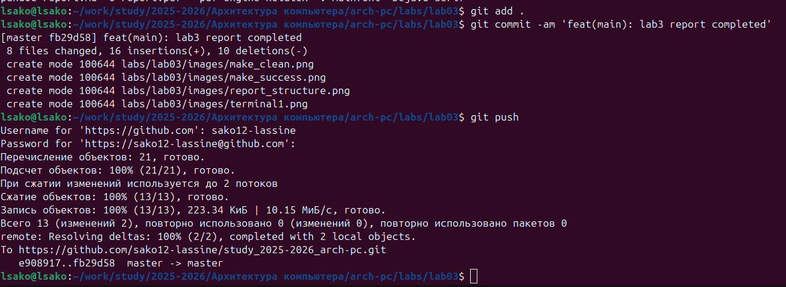

# Цель работы
Освоение процедуры оформления отчетов с помощью легковесного языка разметки Markdown.

# Ход работы

## 1. Открытие терминала

## 2. Переход в каталог курса

cd ~/work/study/2025-2026/"Архитектура компьютера"/arch-pc/

## 3. Компиляция шаблона

### Выполнение команды:

make

### Результат выполнения:
- Файл `report.pdf` успешно создан
- Файл `report.docx` успешно создан
- Процесс компиляции завершен без ошибок

*Рис. 3.1: Результат выполнения команды make*

## 4. Очистка файлов

### Выполнение команды очистки:

make clean

### Результат выполнения:
- Файл `report.pdf` успешно удален
- Файл `report.docx` успешно удален
- Временные файлы компиляции очищены

*Рис. 4.1: Проверка отсутствия файлов после очистки*

## 5. Изучение структуры Markdown файла

### Открытие файла для изучения:

gedit report.md

### Результат изучения:
- Изучена структура файла report.md
- Анализированы основные элементы разметки
- Определены обязательные разделы отчета

*Рис. 5.1: Структура Markdown файла в текстовом редакторе*

## 6. Заполнение отчета и компиляция

### Заполнение отчета:
- Отредактирован файл `report.md`
- Добавлены необходимые разделы
- Размещены изображения в каталоге `images/`

### Проверка наличия изображений:

ls -la images/

### Результат проверки:
- Каталог `images/` содержит необходимые файлы
- Файл `terminal.png` доступен для отчета

*Рис. 6.1: Подтверждение наличия изображений в каталоге*

### Финальная компиляция:

make

**Результат:** Отчет успешно скомпилирован в форматы PDF и DOCX

## 7. Загрузка на GitHub

### Добавление файлов в отслеживание:

git add .

### Создание коммита:

git commit -am 'feat(main): lab3 report completed'

### Отправка на удаленный репозиторий:

git push

### Результат:
- Все файлы лабораторной работы добавлены в репозиторий
- Создан коммит с описанием выполненных работ
- Изменения успешно загружены на GitHub

*Рис. 7.1: Результат выполнения команды git push*

# Задание для самостоятельной работы

## Создание отчета по лабораторной работе №2

### Содержание файла lab02.md:

title: "Лабораторная работа №2"
author: "Сако Лассине"
date: "25 сентября 2025 г."

# Цель работы
Изучение системы контроля версий Git и приобретение практических навыков работы с GitHub.

# Ход работы

## 1. Настройка GitHub
- Создана учетная запись на GitHub
- Заполнены основные данные профиля

## 2. Базовая настройка Git

git config --global user.name "Сако Лассине"
git config --global user.email "1032255150@pfur.ru"
git config --global core.quotepath false
git config --global init.defaultBranch master

### Загрузка на GitHub:

git push

*Рис. 8.1: Процесс загрузки отчета lab02 на GitHub*

# Выводы

В ходе выполнения лабораторной работы №3 были успешно достигнуты следующие результаты:

## Освоенные навыки:
- Основы языка разметки Markdown
- Форматирование текста (заголовки, списки, выделение)
- Работа с изображениями и ссылками
- Создание блоков кода и формул

## Практические достижения:
- Создан полноценный отчет в формате Markdown
- Настроена система компиляции с использованием Makefile
- Освоена работа с Pandoc для генерации PDF и DOCX
- Выполнена загрузка результатов на GitHub

## Значимость полученных умений:
Полученные навыки позволяют эффективно оформлять техническую документацию и отчеты в соответствии с современными стандартами, что является важным компетенцией для дальнейшей учебной и профессиональной деятельности в области информационных технологий.

