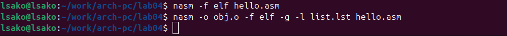
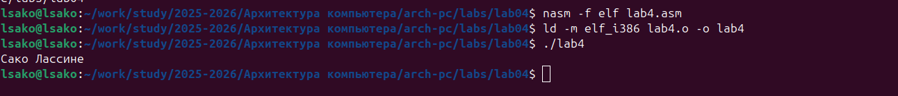

# Цель работы
Освоение процедуры компиляции и сборки программ, написанных на ассемблере NASM.

# Ход работы

## 1. Создание программы Hello World

### Создание каталога и файла:

mkdir -p ~/work/arch-pc/lab04
cd ~/work/arch-pc/lab04
touch hello.asm

```asm
; hello.asm
SECTION .data
    hello: DB 'Hello world!',10
    helloLen: EQU $-hello

SECTION .text
    GLOBAL _start

_start:
    mov eax,4
    mov ebx,1
    mov ecx,hello
    mov edx,helloLen
    int 80h
    
    mov eax,1
    mov ebx,0
    int 80h
    


### Компиляция программы:

nasm -f elf hello.asm

### Расширенная компиляция с отладочной информацией:

nasm -o obj.o -f elf -g -l list.lst hello.asm



*Рис. 2.1: Компиляция программы с помощью NASM*
*Рис. 2.2: Расширенная компиляция с отладочными символами*


### Компоновка объектного файла:

ld -m elf_i386 hello.o -o hello

### Запуск исполняемого файла:
./hello


*Рис. 3.1: Выполнение программы Hello World*

## 2. Самостоятельная работа

### 2.1. Создание программы lab4.asm

**Код программы lab4.asm:**
```asm
; lab4.asm
SECTION .data
    hello: DB 'Сако Лассине',10
    helloLen: EQU $-hello

SECTION .text
    GLOBAL _start

_start:
    mov eax,4
    mov ebx,1
    mov ecx,hello
    mov edx,helloLen
    int 80h
    
    mov eax,1
    mov ebx,0
    int 80h
    


## 4. Выводы

В ходе выполнения лабораторной работы:

1.**Освоен процесс компиляции** программ с помощью NASM
2.**Изучен процесс компоновки** с использованием ld
3.**Созданы рабочие программы** на языке ассемблера
4.**Практически применены** системные вызовы Linux
5.**Освоен базовый синтаксис** NASM
В ходе лабораторной работы №4 были успешно освоены основы работы с ассемблером NASM. Созданы и откомпилированы программы "Hello World" и программа с выводом имени. Освоен процесс трансляции и компоновки программ. Все задачи выполнены, результаты загружены в репозиторий GitHub.

**Цель работы достигнута** - процедура компиляции и сборки программ на ассемблере NASM успешно освоена.
