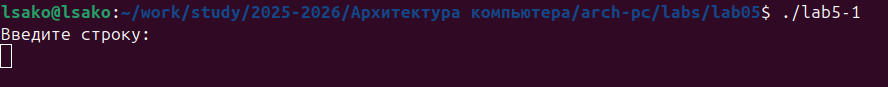
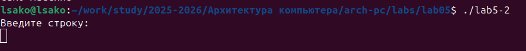
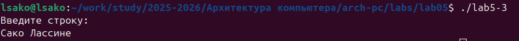
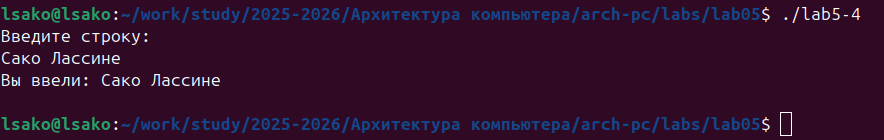

# Лабораторная работа №5
# Введение в ассемблер NASM

**Выполнил:** Сако Лассине  
**Группа:** НПИБД-02-25  
**Дата:** 8.10.2025

## Цель работы
Изучение базового синтаксиса ассемблера NASM и освоение работы с системными вызовами в ОС Linux.

## 5.3. Результаты выполнения лабораторной работы

### 5.3.1. Работа с Midnight Commander
**Выполнение:**
- Создан каталог ~/work/arch-pc/lab05
- Изучена навигация и работа с файлами в mc
- Созданы файлы программ lab5-1.asm и lab5-2.asm

### 5.3.2. Программа lab5-1.asm

**Листинг программы:**

SECTION .data
    msg: DB 'Введите строку:',10
    msgLen: EQU $-msg

SECTION .bss
    buf1: RESB 80

SECTION .text
    GLOBAL _start

_start:
    mov eax,4
    mov ebx,1
    mov ecx,msg
    mov edx,msgLen
    int 80h

    mov eax,3
    mov ebx,0
    mov ecx,buf1
    mov edx,80
    int 80h

    mov eax,1
    mov ebx,0
    int 80h

    
### 5.3.3. Программа lab5-2.asm

**Листинг программы:**

%include 'in_out.asm'

SECTION .data
    msg: DB 'Введите строку: ',0h

SECTION .bss
    buf1: RESB 80

SECTION .text
    GLOBAL _start

_start:
    mov eax, msg
    call sprintLF
    
    mov ecx, buf1
    mov edx, 80
    call sread
    
    call quit

## 5.4. Задание для самостоятельной работы

### Задание 1: Модификация lab5-1.asm

**Листинг программы lab5-3.asm:**

; lab5-3.asm - Модифицированная программа
SECTION .data
    msg: DB 'Введите строку:',10
    msgLen: EQU $-msg
    res: DB 'Вы ввели: ',10
    resLen: EQU $-res

SECTION .bss
    buf1: RESB 80

SECTION .text
    GLOBAL _start

_start:
    mov eax,4
    mov ebx,1
    mov ecx,msg
    mov edx,msgLen
    int 80h

    mov eax,3
    mov ebx,0
    mov ecx,buf1
    mov edx,80
    int 80h

    mov eax,4
    mov ebx,1
    mov ecx,res
    mov edx,resLen
    int 80h

    mov eax,4
    mov ebx,1
    mov ecx,buf1
    mov edx,80
    int 80h

    mov eax,1
    mov ebx,0
    int 80h

### Задание 2: Модификация lab5-2.asm

**Листинг программы lab5-4.asm:**

%include 'in_out.asm'

SECTION .data
    msg: DB 'Введите строку: ',0h
    res: DB 'Вы ввели: ',0h

SECTION .bss
    buf1: RESB 80

SECTION .text
    GLOBAL _start

_start:
    mov eax, msg
    call sprintLF
    
    mov ecx, buf1
    mov edx, 80
    call sread
    
    mov eax, res
    call sprint
    
    mov eax, buf1
    call sprintLF
    
    call quit

## Выводы

-**Оба подхода успешно решают поставленную задачу** - программы lab5-3.asm и lab5-4.asm корректно выполняют ввод и вывод строки
-**Использование внешних подпрограмм упрощает разработку** - подход с in_out.asm требует меньше кода и более читаем
-**Прямые системные вызовы дают больше контроля над процессом** - ручное управление системными вызовами обеспечивает лучший контроль
-**Программы корректно работают с русскими символами** - обеспечена правильная обработка кириллических символов

