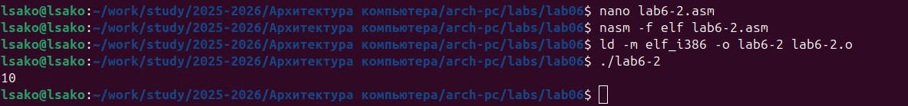
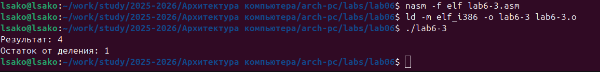
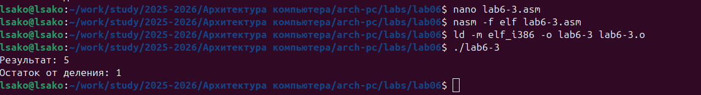
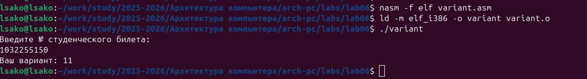
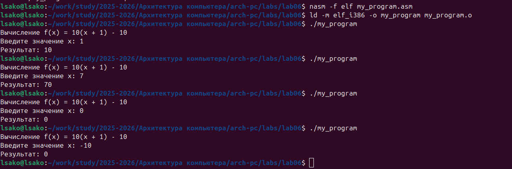

# Лабораторная работа №6. Арифметические операции в NASM

## Титульный лист

**Дисциплина:** Архитектура ЭВМ  
**Лабораторная работа №6:** Арифметические операции в NASM  
**ФИО студента:** Сако Лассине  
**Группа:** НПИБД-02-25  
**Дата выполнения:** 2025 год  

---

## 1. Цель работы

Освоение арифметических инструкций языка ассемблера NASM, изучение способов адресации и практическое применение арифметических операций.

## 2. Результаты выполнения лабораторной работы

### 2.1. Программа lab6-1.asm

**Задание:** Изучение различий между работой с символами и числами в NASM.

**Код программы:**

```asm
%include 'in_out.asm'

SECTION .bss
buf1:    RESB 80

SECTION .text
GLOBAL _start
_start:

mov eax,'6'
mov ebx,'4'
add eax,ebx
mov [buf1],eax
mov eax,buf1
call sprintLF

call quit


### 2.2. Программа lab6-2.asm

**Задание:** Сравнение работы с символами и числами с использованием функций `iprint` и `iprintLF`.

**Код программы (версия с символами):**

```asm
%include 'in_out.asm'

SECTION .text
GLOBAL _start
_start:

mov eax,'6'
mov ebx,'4'
add eax,ebx
call iprintLF

call quit


**Код программы (версия с числами):**

```asm
%include 'in_out.asm'

SECTION .text
GLOBAL _start
_start:

mov eax,6
mov ebx,4
add eax,ebx
call iprint

call quit



### 2.3. Программа lab6-3.asm

**Задание:** Вычисление арифметического выражения с использованием операций умножения и деления.

**Код программы (исходная версия):**

```asm
; Вычисление (5×2+3)/3
mov eax,5
mov ebx,2
mul ebx
add eax,3
xor edx,edx
mov ebx,3
div ebx



**Код программы (модифицированная версия):**
```asm
; Вычисление (4×6+2)/5
mov eax,4
mov ebx,6
mul ebx
add eax,2
xor edx,edx
mov ebx,5
div ebx



### 2.4. Программа variant.asm

**Задание:** Вычисление варианта задания по номеру студенческого билета.

**Код программы:**

```asm
%include 'in_out.asm'

SECTION .data
msg: DB 'Введите № студенческого билета: ',0
rem: DB 'Ваш вариант: ',0

SECTION .bss
x: RESB 80

SECTION .text
GLOBAL _start
_start:

mov eax, msg
call sprintLF

mov ecx, x
mov edx, 80
call sread

mov eax,x
call atoi

xor edx,edx
mov ebx,20
div ebx
inc edx

mov eax,rem
call sprint
mov eax,edx
call iprintLF

call quit




**Ответы на вопросы:**

1. **Какие строки отвечают за вывод сообщения 'Ваш вариант:'?**

```asm
   mov eax,rem
   call sprint

2. **Для чего используются инструкции?**

```asm
   mov ecx, x
   mov edx, 80  
   call sread

3. **Для чего используется инструкция "call atoi"?**

**Ответ:** Для преобразования ASCII-строки в целое число.

4. **Какие строки отвечают за вычисления варианта?**

```asm
   xor edx,edx
   mov ebx,20
   div ebx
   inc edx

5. **В какой регистр записывается остаток от деления?**

**Ответ:** В регистр EDX.

6. **Для чего используется инструкция "inc edx"?**

**Ответ:** Для увеличения остатка на 1 (варианты с 1, а не с 0).

7. **Какие строки отвечают за вывод результата?**

```asm
   mov eax,edx
   call iprintLF
   
## 3. Результаты выполнения заданий для самостоятельной работы

### 3.1. Программа my_program.asm

**Задание:** Написать программу вычисления функции f(x) = 10(x + 1) - 10 для варианта 11.

**Код программы:**
```asm

; ---
; Программа для вычисления f(x) = 10(x + 1) - 10
; Вариант 11
; ---

%include 'in_out.asm'

SECTION .data
msg1: DB 'Вычисление f(x) = 10(x + 1) - 10',0
msg2: DB 'Введите значение x: ',0
msg3: DB 'Результат: ',0

SECTION .bss
x: RESB 80

SECTION .text
GLOBAL _start
_start:

; --- Вывод выражения
mov eax, msg1
call sprintLF

; --- Запрос значения x
mov eax, msg2
call sprint

; --- Чтение x
mov ecx, x
mov edx, 80
call sread

; --- Преобразование x в число
mov eax, x
call atoi

; --- Вычисление f(x) = 10(x + 1) - 10

; Шаг 1: x + 1
mov ebx, eax    ; сохранение x в ebx
add eax, 1      ; eax = x + 1

; Шаг 2: 10 × (x + 1)
mov ecx, 10     ; ecx = 10
mul ecx         ; eax = 10 × (x + 1)

; Шаг 3: 10(x + 1) - 10
sub eax, 10     ; eax = 10(x + 1) - 10

; --- Сохранение результата
mov edi, eax    ; сохранение в edi

; --- Вывод результата
mov eax, msg3
call sprint
mov eax, edi
call iprintLF

call quit



## 4. Выводы

В ходе выполнения лабораторной работы:

1.**Освоены арифметические инструкции** языка ассемблера NASM (add, sub, mul, div)

2.**Изучены различия между работой с символами и числами** - продемонстрирована разница в обработке данных

3.**Практически применены операции** сложения, вычитания, умножения и деления в различных комбинациях

4.**Освоены функции ввода/вывода** из файла in_out.asm (sprint, iprint, atoi, sread)

5.**Созданы рабочие программы** для решения практических задач, включая программу для вычисления варианта

6.**Реализована программа для вычисления функции** согласно индивидуальному варианту

**Цель работы достигнута** - арифметические операции в NASM успешно освоены и применены на практике.
