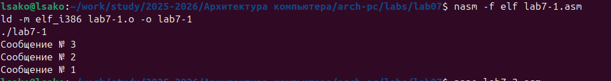
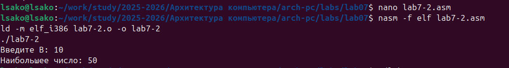
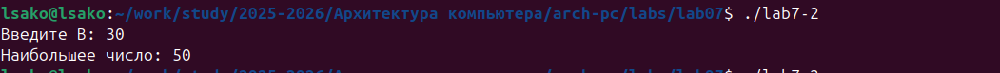
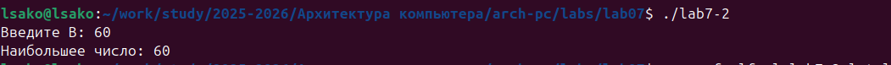
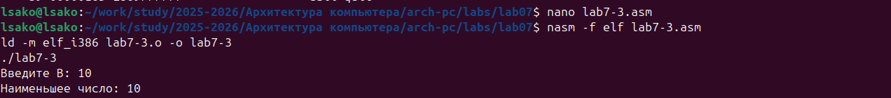
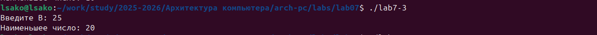
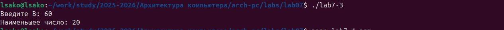
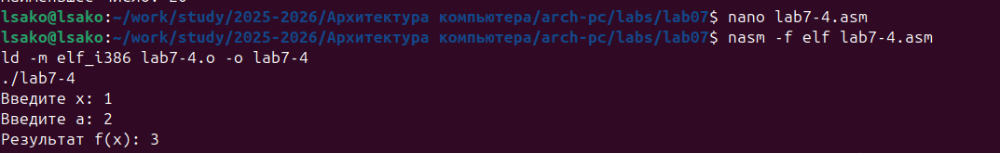
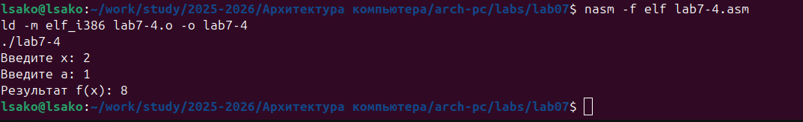

# Лабораторная работа №7. Команды безусловного и условного переходов в Nasm. Программирование ветвлений.

## Титульный лист

**Дисциплина:** Архитектура ЭВМ  
**Лабораторная работа №7:** Команды безусловного и условного переходов в Nasm. Программирование ветвлений.  
**ФИО студента:** Сако Лассине  
**Группа:** НПИБД-02-25  
**Дата выполнения:** 2025 год  

---

## 1. Цель работы

Изучение команд условного и безусловного переходов. Приобретение навыков написания программ с использованием переходов. Знакомство с назначением и структурой файла листинга.

## 2. Результаты выполнения лабораторной работы

### 2.1. Программа lab7-1.asm

**Задание:** Изучение команд безусловного перехода jmp и создание программы с различными последовательностями выполнения.

**Код программы (версия 3 → 2 → 1):**

```asm
%include 'in_out.asm'

SECTION .data
msg1: DB 'Сообщение № 1',0
msg2: DB 'Сообщение № 2',0
msg3: DB 'Сообщение № 3',0

SECTION .text
GLOBAL _start
_start:
    jmp _label3

_label1:
    mov eax, msg1
    call sprintLF
    jmp _end

_label2:
    mov eax, msg2
    call sprintLF
    jmp _label1

_label3:
    mov eax, msg3
    call sprintLF
    jmp _label2

_end:
    call quit

    

### 2.2. Программа lab7-2.asm

**Задание:** Написание программы для нахождения наибольшего из трех целочисленных переменных A, B и C.

**Код программы:**

```asm
%include 'in_out.asm'

section .data
msg1 db 'Введите B: ',0h
msg2 db "Наибольшее число: ",0h
A dd '20'
C dd '50'

section .bss
max resb 10
B resb 10

section .text
global _start
_start:
    mov eax,msg1
    call sprint
    
    mov ecx,B
    mov edx,10
    call sread
    
    mov eax,B
    call atoi
    mov [B],eax
    
    mov ecx,[A]
    mov [max],ecx
    
    cmp ecx,[C]
    jg check_B
    mov ecx,[C]
    mov [max],ecx
    
check_B:
    mov eax,max
    call atoi
    mov [max],eax
    
    mov ecx,[max]
    cmp ecx,[B]
    jg fin
    mov ecx,[B]
    mov [max],ecx
    
fin:
    mov eax, msg2
    call sprint
    mov eax,[max]
    call iprintLF
    call quit
    






### 2.3. Изучение файла листинга

**Генерация файла листинга:**
```bash
nasm -f elf -l lab7-2.lst lab7-2.asm


## 3. Результаты выполнения заданий для самостоятельной работы

### 3.1. Программа lab7-3.asm

**Задание:** Написание программы для нахождения наименьшей из 3 целочисленных переменных a, b и c.

**Код программы:**

```asm
%include 'in_out.asm'

section .data
msg1 db 'Введите B: ',0h
msg2 db "Наименьшее число: ",0h
A dd '20'
C dd '50'

section .bss
min resb 10
B resb 10

section .text
global _start
_start:
    mov eax,msg1
    call sprint
    
    mov ecx,B
    mov edx,10
    call sread
    
    mov eax,B
    call atoi
    mov [B],eax
    
    mov ecx,[A]
    mov [min],ecx
    
    cmp ecx,[C]
    jl check_B
    mov ecx,[C]
    mov [min],ecx
    
check_B:
    mov eax,min
    call atoi
    mov [min],eax
    
    mov ecx,[min]
    cmp ecx,[B]
    jl fin
    mov ecx,[B]
    mov [min],ecx
    
fin:
    mov eax, msg2
    call sprint
    mov eax,[min]
    call iprintLF
    call quit
    






### 3.2. Программа lab7-4.asm

**Задание:** Написание программы, которая для введенных с клавиатуры значений x и a вычисляет значение заданной функции f(x) и выводит результат вычислений.

**Код программы для варианта 1:**

```asm
%include 'in_out.asm'

section .data
msg_x db 'Введите x: ',0h
msg_a db 'Введите a: ',0h
msg_result db 'Результат f(x): ',0h

section .bss
x resb 10
a resb 10
result resb 10

section .text
global _start
_start:
    mov eax, msg_x
    call sprint
    mov ecx, x
    mov edx, 10
    call sread
    mov eax, x
    call atoi
    mov [x], eax

    mov eax, msg_a
    call sprint
    mov ecx, a
    mov edx, 10
    call sread
    mov eax, a
    call atoi
    mov [a], eax

    mov ebx, [x]
    mov ecx, [a]
    
    cmp ebx, ecx
    jge else_branch

    mov eax, ecx
    mov edx, 2
    imul eax, edx
    sub eax, ebx
    jmp output

else_branch:
    mov eax, 8

output:
    mov [result], eax
    
    mov eax, msg_result
    call sprint
    mov eax, [result]
    call iprintLF
    
    call quit
    




## 4. Ответы на вопросы для самопроверки

1. **Для чего нужен файл листинга NASM? В чём его отличие от текста программы?**

   **Ответ:** Файл листинга содержит дополнительную информацию: номера строк, адреса памяти, машинный код. В отличие от исходного текста, он показывает как программа выглядит после ассемблирования.

2. **Каков формат файла листинга NASM? Из каких частей он состоит?**

   **Ответ:** Формат: номер строки, адрес, машинный код, исходный код. Состоит из: номера строки, смещения в сегменте, шестнадцатеричного кода инструкции, исходного текста.

3. **Как в программах на ассемблере можно выполнить ветвление?**

   **Ответ:** С помощью команд безусловного перехода (jmp) и условных переходов (je, jg, jl, ja, jb и др.).

4. **Какие существуют команды безусловного и условных переходов в языке ассемблера?**

   **Ответ:** 
   - Безусловные: jmp
   - Условные: je/jz, jne/jnz, jg/jnle, jl/jnge, ja/jnbe, jb/jnae

5. **Опишите работу команды сравнения cmp.**

   **Ответ:** Команда cmp выполняет вычитание операндов без сохранения результата, только устанавливает флаги в зависимости от результата сравнения.

6. **Каков синтаксис команд условного перехода?**

   **Ответ:** j<условие> метка (например: jg label, jl check)

7. **Приведите пример использования команды сравнения и команд условного перехода.**

   **Ответ:** 
   ```asm
   cmp eax, ebx
   jg greater
   mov ecx, ebx
   jmp end
   greater:
   mov ecx, eax
   end:
8. **Какие флаги анализируют команды условного перехода?**

   **Ответ:** ZF (ноль), CF (перенос), SF (знак), OF (переполнение), PF (четность).
   
## 5. Выводы

В ходе выполнения лабораторной работы:

1. **Освоены команды безусловного перехода** - изучена инструкция jmp и ее применение для изменения потока выполнения программы.

2. **Изучены команды условных переходов** - практически применены инструкции jg, jl, jge для реализации ветвлений в программах.

3. **Практически освоено программирование ветвлений** - созданы программы с сложной логикой выполнения, включая поиск максимального и минимального значений.

4. **Изучена структура файла листинга** - проанализирован формат вывода NASM, понимание связи между исходным кодом и машинными инструкциями.

5. **Разработаны программы для самостоятельной работы** - успешно реализованы программы для нахождения минимального значения и вычисления функции согласно варианту.

6. **Освоена работа с регистром флагов** - понимание того, как условные переходы анализируют состояние флагов после операций сравнения.

**Цель работы достигнута** - команды переходов в NASM успешно изучены и применены для создания программ с ветвлениями, освоена работа с файлами листинга.


