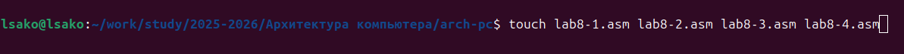
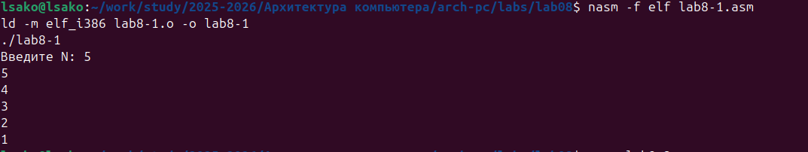
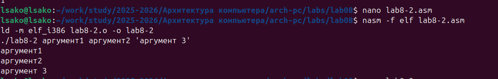
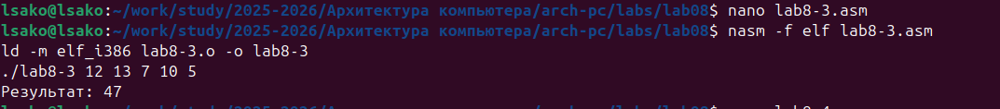
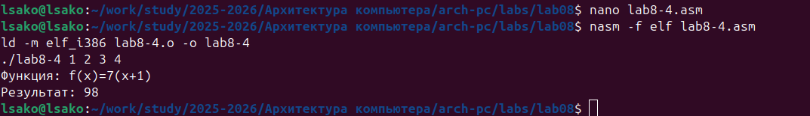
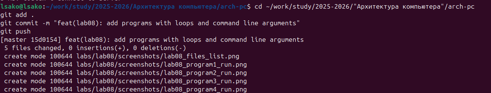
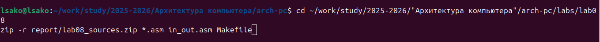

# Цель работы
Приобретение навыков написания программ с использованием циклов и обработкой аргументов командной строки.

# Ход работы

## 1. Создание каталога и файлов

```bash
mkdir -p ~/work/arch-pc/lab08
cd ~/work/arch-pc/lab08
touch lab8-1.asm lab8-2.asm lab8-3.asm lab8-4.asm



## 2. Программа с циклом (lab8-1.asm)

### Код программы:
```asm
%include 'in_out.asm'

SECTION .data
msg1 db 'Введите N: ',0h

SECTION .bss
N resb 10

SECTION .text
global _start
_start:
    mov eax, msg1
    call sprint
    
    mov ecx, N
    mov edx, 10
    call sread
    
    mov eax, N
    call atoi
    mov [N], eax
    
    mov ecx, [N]
label:
    mov [N], ecx
    mov eax, [N]
    call iprintLF
    loop label
    
    call quit



## 3. Обработка аргументов командной строки (lab8-2.asm)

### Код программы:
```asm
%include 'in_out.asm'

SECTION .text
global _start

_start:
    pop ecx
    pop edx
    sub ecx, 1

next:
    cmp ecx, 0
    jz _end
    pop eax
    call sprintLF
    loop next

_end:
    call quit



## 4. Программа вычисления суммы аргументов (lab8-3.asm)

### Код программы:
```asm
%include 'in_out.asm'

SECTION .data
msg db "Результат: ",0

SECTION .text
global _start

_start:
    pop ecx
    pop edx
    sub ecx, 1
    mov esi, 0

next:
    cmp ecx, 0
    jz _end
    pop eax
    call atoi
    add esi, eax
    loop next

_end:
    mov eax, msg
    call sprint
    mov eax, esi
    call iprintLF
    call quit



## 5. Программа вычисления суммы функции (lab8-4.asm)

### Код программы:
```asm
%include 'in_out.asm'

SECTION .data
msg_func db "Функция: f(x)=7(x+1)",0
msg_res db "Результат: ",0

SECTION .text
global _start

_start:
    pop ecx
    pop edx
    sub ecx, 1
    mov esi, 0

next:
    cmp ecx, 0
    jz _end
    pop eax
    call atoi
    
    add eax, 1
    mov ebx, 7
    imul eax, ebx
    
    add esi, eax
    loop next

_end:
    mov eax, msg_func
    call sprintLF
    mov eax, msg_res
    call sprint
    mov eax, esi
    call iprintLF
    call quit



## 6. Загрузка файлов на GitHub

```bash
cd ~/work/study/2025-2026/"Архитектура компьютера"/arch-pc
git add .
git commit -m "feat(lab08): add programs with loops and command line arguments"
git push



## 7. Создание архива исходных материалов

```bash
cd ~/work/study/2025-2026/"Архитектура компьютера"/arch-pc/labs/lab08
zip -r report/lab08_sources.zip *.asm in_out.asm Makefile



# Выводы

В ходе выполнения лабораторной работы №8 были успешно освоены:

## Теоретические знания:
- Изучена организация стека и операции push/pop
- Освоена работа с инструкцией Loop для организации циклов
- Изучены принципы обработки аргументов командной строки

## Практические навыки:
- Созданы программы с использованием циклов
- Реализована обработка аргументов командной строки
- Освоена работа со стеком для сохранения значений регистров
- Написана программа вычисления суммы значений функции

## Выполненные задачи:
- Создана программа с циклом для вывода чисел (lab8-1.asm)
- Реализована программа вывода аргументов командной строки (lab8-2.asm)
- Написана программа вычисления суммы аргументов (lab8-3.asm)
- Создана программа вычисления суммы функции f(x) (lab8-4.asm)

Цель работы достигнута - приобретены навыки написания программ с использованием циклов и обработкой аргументов командной строки.

