# Лабораторная работа №9. Понятие подпрограммы. Отладчик GDB.

## Титульный лист

**Дисциплина:** Архитектура ЭВМ  
**Лабораторная работа №9:** Понятие подпрограммы. Отладчик GDB.  
**ФИО студента:** Сако Лассине  
**Группа:** НПИБД-02-25  
**Дата выполнения:** 2025 год  

---

## 1. Цель работы

Приобретение навыков написания программ с использованием подпрограмм. Знакомство с методами отладки при помощи GDB и его основными возможностями.

## 2. Результаты выполнения лабораторной работы

### 2.1. Программа lab09-1.asm

**Задание:** Реализация программы вычисления арифметического выражения с использованием подпрограммы.

**Код программы:**
```asm
%include 'in_out.asm'

SECTION .data
    msg: DB 'Введите x: ',0
    result: DB '2x+7=',0

SECTION .bss
    x: RESB 80
    res: RESB 80

SECTION .text
GLOBAL _start
_start:

;---
; Основная программа
;---
    mov eax, msg
    call sprint

    mov ecx, x
    mov edx, 80
    call sread

    mov eax,x
    call atoi

    call _calcul    ; Вызов подпрограммы _calcul

    mov eax,result
    call sprint
    mov eax,[res]
    call iprintLF

    call quit

;---
; Подпрограмма вычисления
; выражения "2x+7"
_calcul:
    mov ebx,2
    mul ebx
    add eax,7
    mov [res],eax
    ret    ; выход из подпрограммы
    

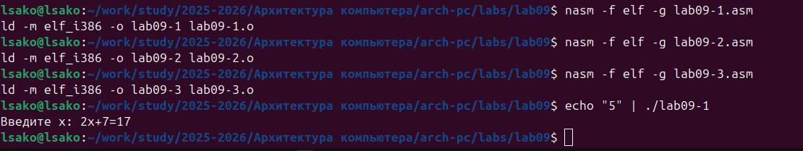


### 2.2. Программа lab09-2.asm

**Задание:** Создание программы "Hello World" для изучения отладчика GDB.

**Код программы:**
```asm
SECTION .data
    msg1:    db "Hello, ",0
    msg1Len:   equ $ - msg1

    msg2:    db "world!",0xa
    msg2Len:   equ $ - msg2

SECTION .text
    global _start

_start:
    mov eax, 4
    mov ebx, 1
    mov ecx, msg1
    mov edx, msg1Len
    int 0x80

    mov eax, 4
    mov ebx, 1
    mov ecx, msg2
    mov edx, msg2Len
    int 0x80

    mov eax, 1
    mov ebx, 0
    int 0x80

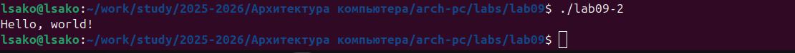 


### 2.3. Работа с отладчиком GDB

**Задание:** Изучение основных возможностей отладчика GDB.


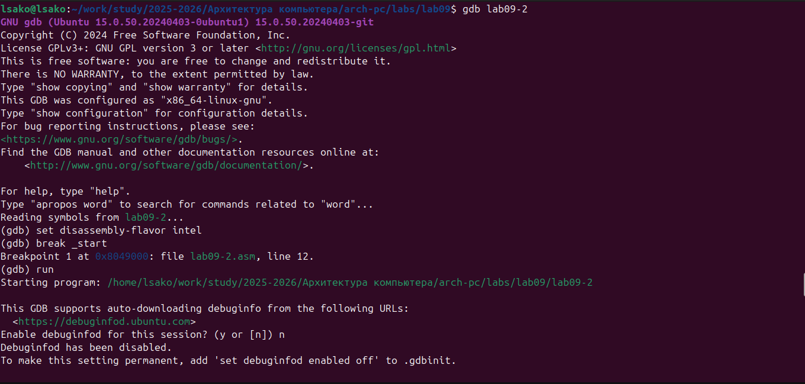


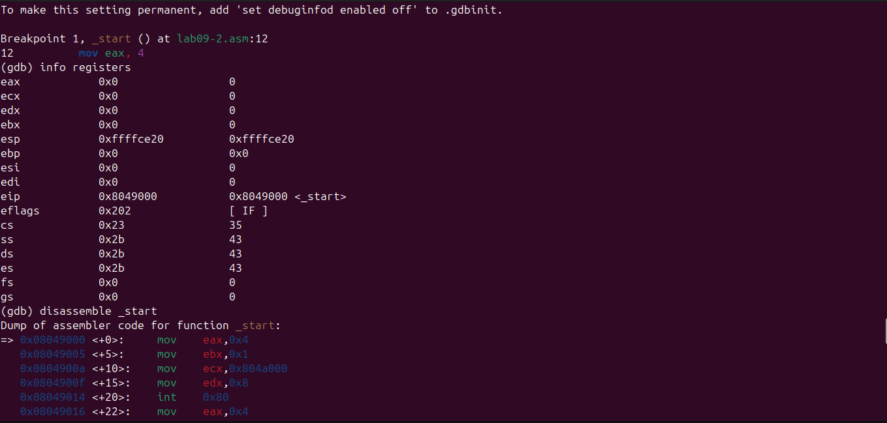


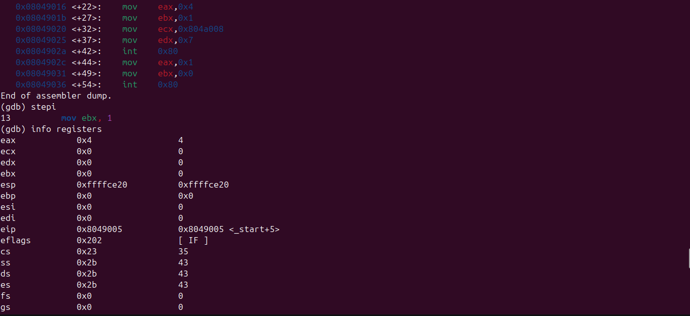


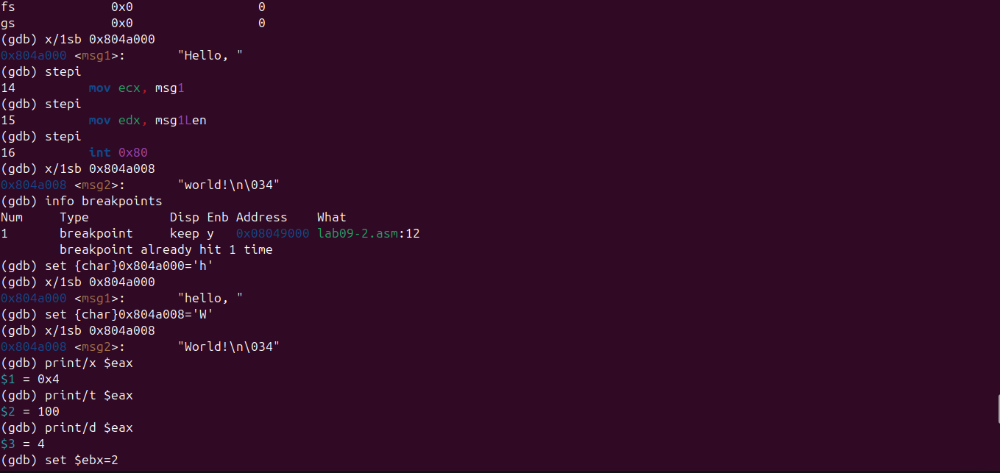


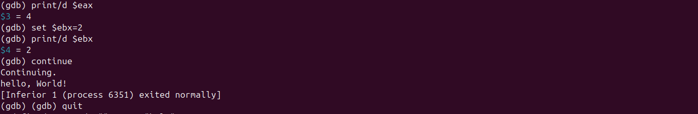

### 2.4. Программа lab09-3.asm

**Задание:** Создание программы для обработки аргументов командной строки.

**Код программы:**
```asm
SECTION .data
    newline: db 0xA

SECTION .text
    global _start

_start:
    ; Получаем количество аргументов
    pop eax         ; argc

    ; Пропускаем имя программы
    pop ebx         ; argv[0]

print_args:
    ; Печатаем аргумент
    pop ebx         ; следующий аргумент
    test ebx, ebx
    jz exit

    ; Вычисляем длину строки
    mov ecx, ebx
    call strlen

    ; Вывод аргумента
    mov edx, eax    ; длина
    mov eax, 4      ; sys_write
    mov ebx, 1      ; stdout
    int 0x80

    ; Вывод новой строки
    mov eax, 4
    mov ebx, 1
    mov ecx, newline
    mov edx, 1
    int 0x80

    jmp print_args

exit:
    mov eax, 1      ; sys_exit
    mov ebx, 0      ; код выхода
    int 0x80

; Функция вычисления длины строки
; Вход: ecx = адрес строки
; Выход: eax = длина
strlen:
    push ecx
    mov eax, 0
.count_loop:
    cmp byte [ecx], 0
    je .done
    inc ecx
    inc eax
    jmp .count_loop
.done:
    pop ecx
    ret
    
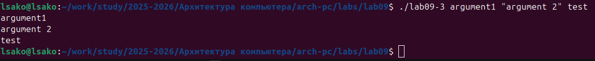

### 2.5. Анализ аргументов командной строки в GDB

**Задание:** Исследование расположения аргументов командной строки в стеке.


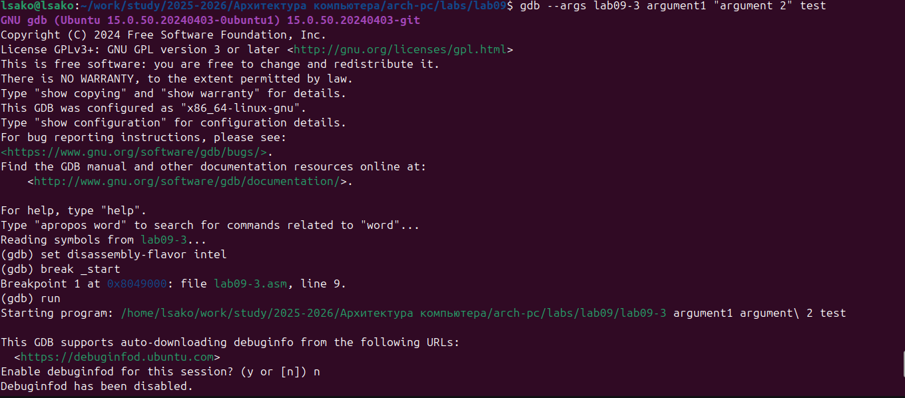


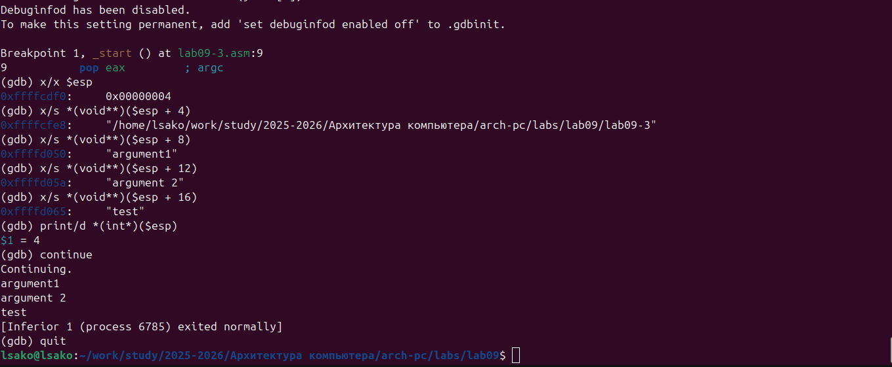

### 2.6. Проверка отладочной информации

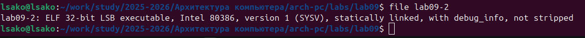

## 3. Результаты выполнения заданий для самостоятельной работы

### 3.1. Модификация программы lab09-1.asm

**Задание:** Добавление подпрограммы _subcalcul в подпрограмму _calcul для вычисления выражения f(g(x)).

**Модифицированный код:**
```asm
%include 'in_out.asm'

SECTION .data
    msg: DB 'Введите x: ',0
    result: DB 'f(g(x))=2*(3x-1)+7=',0

SECTION .bss
    x: RESB 80
    res: RESB 80
    temp: RESB 80

SECTION .text
GLOBAL _start
_start:
    mov eax, msg
    call sprint

    mov ecx, x
    mov edx, 80
    call sread

    mov eax,x
    call atoi

    call _calcul

    mov eax,result
    call sprint
    mov eax,[res]
    call iprintLF

    call quit

;---
; Подпрограмма вычисления f(g(x))
_calcul:
    push eax        ; сохраняем x
    call _subcalcul ; вычисляем g(x)=3x-1
    mov ebx,2
    mul ebx         ; 2*g(x)
    add eax,7       ; 2*g(x)+7
    mov [res],eax
    pop eax         ; восстанавливаем стек
    ret

;---
; Подпрограмма вычисления g(x)=3x-1
_subcalcul:
    mov ebx,3
    mul ebx         ; 3*x
    sub eax,1       ; 3*x-1
    ret
    
### 3.2. Отладка программы с ошибкой

**Задание:** Найти и исправить ошибку в программе вычисления выражения (3+2)*4+5 с помощью GDB.

**Исправленный код:**
```asm
%include 'in_out.asm'

SECTION .data
div: DB 'Результат: ',0

SECTION .text
GLOBAL _start
_start:
; --- Вычисление выражения (3+2)*4+5
    mov eax,3
    mov ebx,2
    add eax,ebx     ; (3+2)=5
    mov ebx,4
    mul ebx         ; 5*4=20
    add eax,5       ; 20+5=25
    mov edi,eax

; --- Вывод результата на экран
    mov eax,div
    call sprint
    mov eax,edi
    call iprintLF
    call quit 
    
## 4. Ответы на вопросы для самопроверки

1. **Какие языковые средства используются в ассемблере для оформления и активизации подпрограмм?**

2. **Объясните механизм вызова подпрограмм.**

3. **Как используется стек для обеспечения взаимодействия между вызывающей и вызываемой процедурами?**

4. **Каково назначение операнда в команде ret?**

5. **Для чего нужен отладчик?**

6. **Объясните назначение отладочной информации и как нужно компилировать программу, чтобы в ней присутствовала отладочная информация.**

7. **Расшифруйте и объясните следующие термины: breakpoint, watchpoint, checkpoint, catchpoint и call stack.**

8. **Назовите основные команды отладчика gdb и как они могут быть использованы для отладки программ.**

## 5. Выводы

В ходе выполнения лабораторной работы:

1. **Освоено программирование с использованием подпрограмм** - изучены инструкции call и ret, созданы программы с многоуровневыми вызовами подпрограмм.

2. **Приобретены навыки работы с отладчиком GDB** - освоены команды установки точек останова, пошагового выполнения, анализа регистров и памяти.

3. **Изучены методы отладки программ** - практически применены различные подходы к поиску и исправлению ошибок.

4. **Освоена работа с аргументами командной строки** - исследовано расположение параметров в стеке памяти.

5. **Практически применены навыки модификации программ** - успешно добавлены дополнительные подпрограммы и исправлены ошибки в существующем коде.

6. **Изучены возможности отладочной информации** - освоена компиляция программ с ключом -g для эффективной отладки.

**Цель работы достигнута** - приобретены практические навыки написания программ с подпрограммами и использования отладчика GDB для анализа и отладки кода.  
