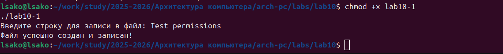
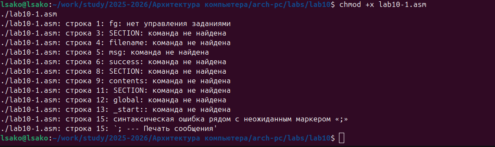
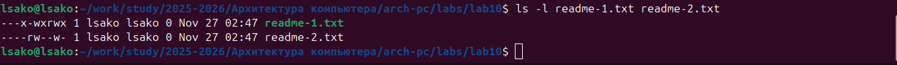
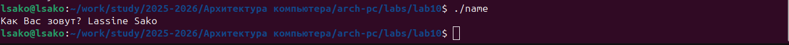
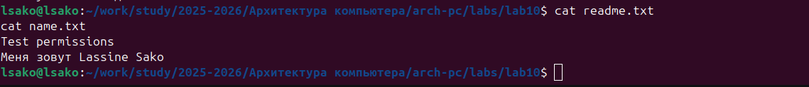

# Лабораторная работа №10. Работа с файлами средствами Nasm

## Титульный лист

**Дисциплина:** Архитектура ЭВМ  
**Лабораторная работа №10:** Работа с файлами средствами Nasm  
**ФИО студента:** Сако Лассине  
**Группа:** НПИБД-02-25  
**Дата выполнения:** 2025 год  

---

## 1. Цель работы

Приобретение навыков написания программ для работы с файлами.

## 2. Результаты выполнения лабораторной работы

### 2.1. Программа lab10-1.asm

**Задание:** Реализация программы записи в файл сообщения, введенного с клавиатуры.

**Код программы:**
```asm
%include 'in_out.asm'

SECTION .data
filename db 'readme.txt', 0
msg db 'Введите строку для записи в файл: ', 0
success db 'Файл успешно создан и записан!', 0

SECTION .bss
contents resb 255

SECTION .text
global _start
_start:

; --- Печать сообщения
mov eax, msg
call sprint

; --- Ввод строки
mov ecx, contents
mov edx, 255
call sread

; --- Создание файла (sys_creat)
mov ecx, 0644o
mov ebx, filename
mov eax, 8
int 0x80

; --- Сохранение дескриптора
mov esi, eax

; --- Расчет длины введенной строки
mov eax, contents
call slen

; --- Запись в файл
mov edx, eax
mov ecx, contents
mov ebx, esi
mov eax, 4
int 0x80

; --- Закрытие файла
mov ebx, esi
mov eax, 6
int 0x80

; --- Сообщение об успехе
mov eax, success
call sprintLF

call quit



### 2.2. Работа с правами доступа

**Задание:** Изучение команд изменения прав доступа к файлам.





### 2.3. Права доступа к файлам readme-1.txt и readme-2.txt

**Задание:** Применение прав доступа в символьном и двоичном виде.

- **readme-1.txt**: `--x-wxrwx` (0137 в восьмеричной системе)
- **readme-2.txt**: `----rw--w-` (062 в восьмеричной системе)

## 3. Результаты выполнения заданий для самостоятельной работы

### 3.1. Программа name.asm

**Задание:** Создание программы, которая запрашивает имя пользователя и записывает его в файл.

**Код программы:**
```asm
%include 'in_out.asm'

SECTION .data
filename db 'name.txt', 0
msg1 db 'Как Вас зовут? ', 0
msg2 db 'Меня зовут ', 0

SECTION .bss
name resb 255

SECTION .text
global _start
_start:

; --- Вопрос "Как Вас зовут?"
mov eax, msg1
call sprint

; --- Ввод имени
mov ecx, name
mov edx, 255
call sread

; --- Создание файла
mov ecx, 0644o
mov ebx, filename
mov eax, 8
int 0x80
mov esi, eax

; --- Запись "Меня зовут "
mov eax, msg2
call slen
mov edx, eax
mov ecx, msg2
mov ebx, esi
mov eax, 4
int 0x80

; --- Запись имени
mov eax, name
call slen
mov edx, eax
mov ecx, name
mov ebx, esi
mov eax, 4
int 0x80

; --- Закрытие файла
mov ebx, esi
mov eax, 6
int 0x80

call quit



### 3.2. Проверка результатов



## 4. Ответы на вопросы для самопроверки

1. **Каким образом в Unix-подобных ОС определяются права доступа к файлу?**

2. **Как ОС определяет, является ли файл исполняемым? Как регулировать права на чтение и запись?**

3. **Как разграничить права доступа для различных категорий пользователей?**

4. **Какой номер имеют системные вызовы sys_read, sys_write, sys_open, sys_close, sys_creat?**

5. **Какие регистры и как используют системные вызовы sys_read, sys_write, sys_open, sys_close, sys_creat?**

6. **Что такое дескриптор файла?**

## 5. Выводы

В ходе выполнения лабораторной работы:

1. **Освоено программирование работы с файлами** - изучены системные вызовы для создания, записи и закрытия файлов.

2. **Приобретены навыки использования системных вызовов** - практически применены sys_creat, sys_write, sys_close для работы с файловой системой.

3. **Изучены права доступа к файлам** - освоены команды chmod для управления правами доступа в символьном и числовом формате.

4. **Практически применены навыки создания интерактивных программ** - разработана программа, взаимодействующая с пользователем и файловой системой.

5. **Освоена работа с дескрипторами файлов** - понимание механизма работы с файлами через дескрипторы в ОС Linux.

6. **Изучены методы обработки ошибок** - анализ поведения программ при неправильных правах доступа.

**Цель работы достигнута** - приобретены практические навыки написания программ для работы с файлами и управления правами доступа в ОС Linux.

